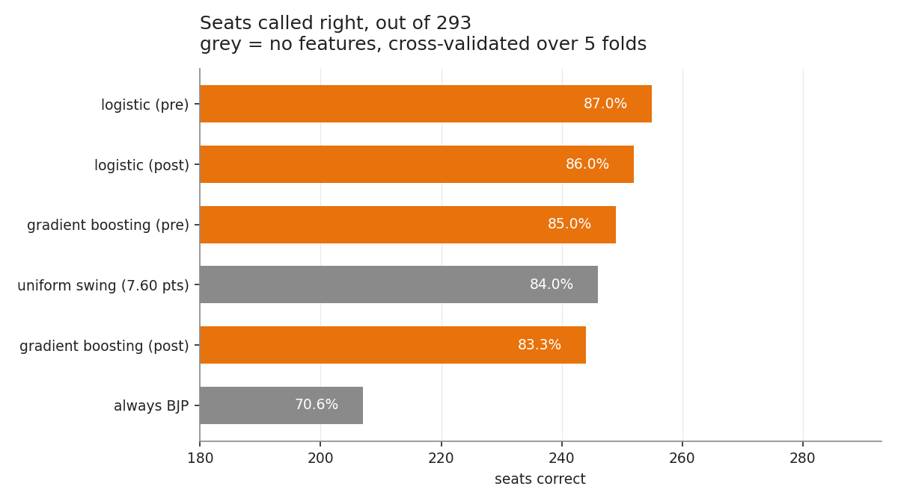
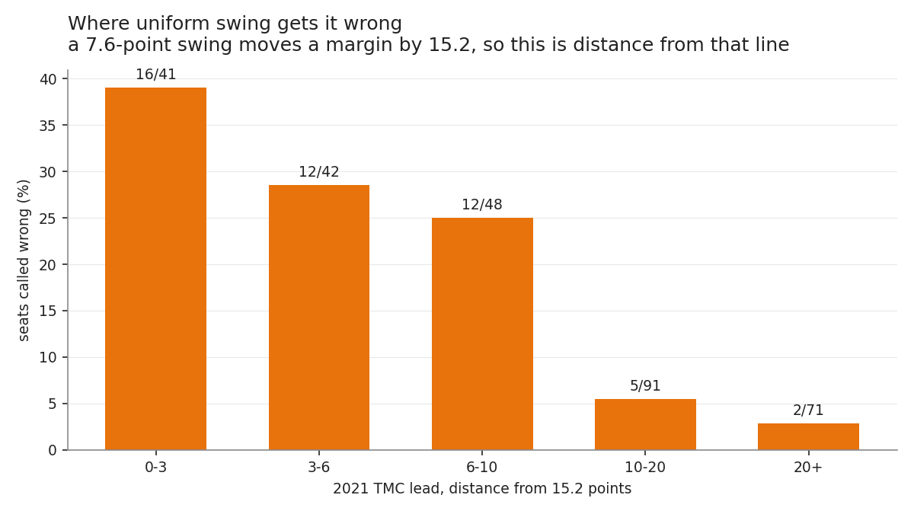
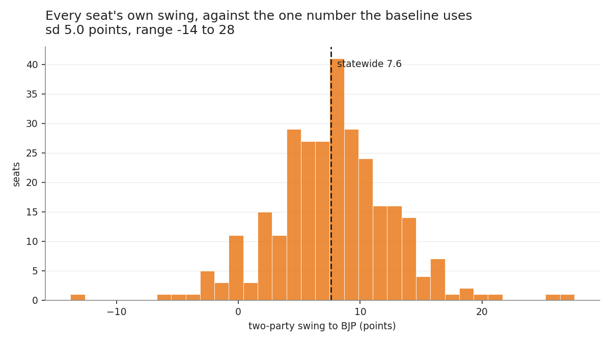
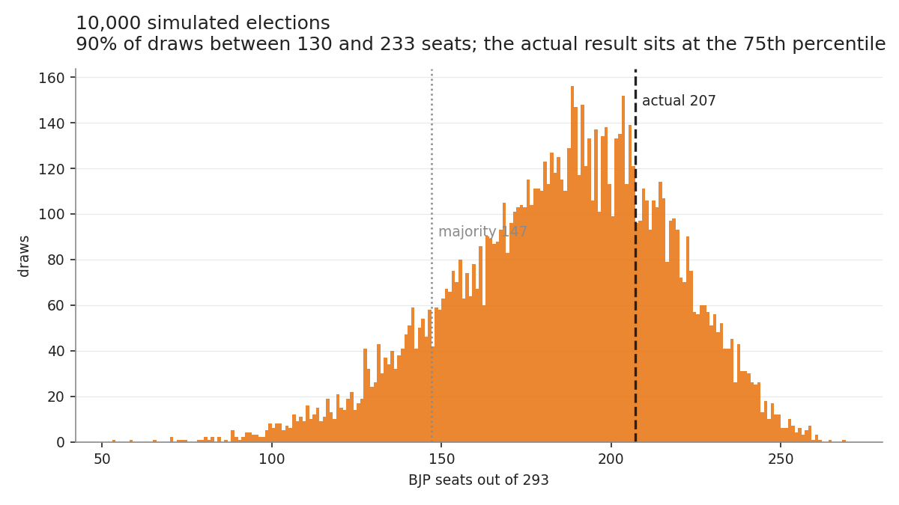

# Bengal Election Swing Model

Does a uniform statewide swing predict the 2026 West Bengal assembly result
from the 2021 one, and which seats does it get wrong?

Short answer: it gets 246 of 293 right knowing nothing about any individual
seat, and the ones it misses are not the ones I expected.

## Where this starts

I cleaned the Election Commission's reports for both elections earlier this
year and wrote up what changed. TMC fell from 215 seats to 80, BJP rose from 77
to 207, and about 15 points of vote share moved between them.

That write-up was descriptive. It showed the seat swing was that large because
most 2021 margins were small, but it never tested whether you could have called
the seat count from the vote swing alone. This does.

The method is the oldest one in election forecasting. Take each seat's 2021
result, move one statewide number from TMC to BJP, recount. No candidate, no
incumbency, no local anything. Then look at what's left over.

## What the baseline does

The statewide two-party swing was 7.60 points. Applied uniformly:

| | seats called right | BJP seats |
|---|---|---|
| say "BJP" every time | 207 of 293 (70.6%) | 293 |
| uniform swing, 7.60 points | 246 of 293 (84.0%) | 198 |
| best fitted model | 255 of 293 (87.0%) | 217 |
| **actual** | | **207** |

So most of the work is done by arithmetic. Uniform swing closes about two
thirds of the gap between guessing and perfect, and everything I fitted on top
of it added another three points.



The fitted models are cross-validated over seats, five folds, so no seat is
scored by a model that trained on it. That is still not a held-out election,
and the model card says so at more length.

## Two things I didn't expect

### The roll shrinking doesn't explain anything

The headline of the descriptive work was that West Bengal's electoral roll lost
about 5 million names between the two elections, which inflated reported
turnout. I assumed that would matter here.

It doesn't. I built two feature sets deliberately kept apart: one with only
what was knowable before polling day, one that adds the 2026 roll change and
turnout change. The second set scores *worse*, on both model families. Once you
know a seat's 2021 result, knowing how its register moved tells you nothing
useful about who won it.

That surprised me enough that I went looking for a bug and didn't find one.

### The close seats are the easy ones

I expected the baseline to fail on knife-edge seats. The opposite is true.

Seats decided by under 5 points in 2021: 2 misses out of 70. Seats decided by
15 to 25 points: 23 misses out of 56.



It's arithmetic again. A 7.60-point swing moves a two-party margin by 15.2
points, so 15.2 is the line where the baseline flips a seat. A seat held by 3
points flips under any positive swing and no amount of local variation rescues
it. A seat held by 16 points sits right on the boundary, and there the
five-point spread of local swing decides it either way.

Miss rate runs from 39% within 3 points of that line down to 2.8% beyond 20.
The errors track distance from the tipping point, not closeness.

By region, Kolkata and Howrah is worst at 10 of 27 wrong, North Bengal best at
4 of 54.

## The swing wasn't uniform, and not randomly so

Each seat's own swing has a standard deviation of 5 points around the statewide
7.6, running from −13.8 to +27.6. Some seats moved to TMC while the state moved
hard the other way.



I first treated that as noise. Then the simulation came out averaging 182 seats
against an actual 207, which was too far off to leave alone.

It isn't noise. Regress each seat's swing on its 2021 TMC lead and the slope is
+0.0985: BJP gained roughly one extra point for every ten points of lead TMC
had to defend. 5.9 points where BJP already held the seat, 9.4 where TMC was
safe. The R² is only 0.11, so as a fit it's weak, but it acts on exactly the
safe seats a uniform swing never flips, so it moves the seat total a long way.

Putting it in takes the deterministic call from 198 to 204, against an actual
207.

## How much rests on the assumption

One point of swing is worth about 12 seats around the actual result, so a seat
projection is mostly a statement about the swing you assumed.



Ten thousand draws over the statewide swing and local deviation put 90% of
outcomes between 130 and 232 seats. The actual 207 sits around the 75th
percentile.

The simulation stays a little pessimistic about BJP even after the lead-scaling
correction. That one has a cause: mean-zero seat noise *lowers* the expected
total, because more seats sit just inside the tipping line than just outside,
so noise knocks more out than it brings in. It reads like a bug, so there's a
test pinning it.

## Running it

```bash
python3 -m venv .venv
source .venv/bin/activate
pip install -r requirements.txt
./run_all.sh
```

`run_all.sh` rebuilds the feature table, the model comparison, the figures and
the simulation, then runs the tests. About a minute.

The app, for dragging a swing around:

```bash
streamlit run app/streamlit_app.py
```

Notebooks 04 to 06 walk through models, residuals and simulation. Numbering
starts at 04 because 01 to 03 were the cleaning and descriptive work, which
live in the other repo.

## Tests

38 of them, `python3 -m pytest`. The ones that earn their keep are the
reconciliation tests in `tests/test_features.py`, which re-derive published
totals from the feature table by a different route than the code that built it.

Two caught real errors. The zero-swing test caught a baseline that picked
winners by argmax across aggregate party blocs — in Darjeeling the "other"
bloc sums to 57% because several hill parties split that vote, while BJP
actually won the seat on 41.5%. A bloc sum is not a candidate. And a comment
pinning Falta to the wrong constituency number got caught by a test that reads
it from the database.

## What this isn't

A forecast. Every parameter here was fitted on the election it then predicts,
including the lead-scaling slope. Two elections in one state means there is no
held-out election, so cross-validation over seats is the best available and it
is not the same thing. The interval says how sensitive a seat total is to the
swing given 2021, not how uncertain anyone should have been beforehand.

It's also silent on why anyone voted the way they did, and on why the register
shrank. See [docs/model_card.md](docs/model_card.md).

## Attribution

The database under `data/raw/` came out of my earlier project,
`bengal-election-analysis`, which built it from Election Commission of India
statistical reports for the West Bengal Legislative Assembly, 2021 and 2026.
The Commission is the source for every number in it. See
[data/raw/README.md](data/raw/README.md) for provenance and for the known
problems with the data, which are worth reading before you trust a join.

Code here is mine and MIT licensed, see [LICENSE](LICENSE). The election data
isn't mine and the licence doesn't cover it.
